# 🚀 Lead Conversion Intelligence System using Machine Learning

<div align="center">
  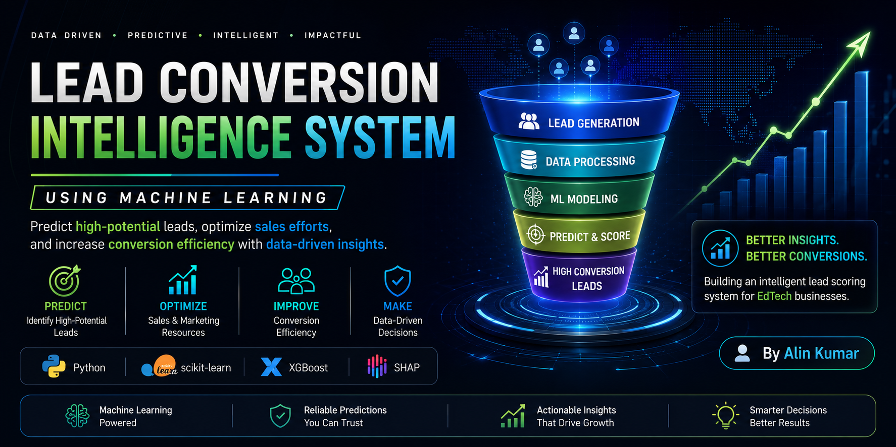
</div>

<br>

> **An end-to-end machine learning solution that predicts high-potential leads for an EdTech business, enabling sales teams to prioritize prospects, improve conversion efficiency, and make data-driven decisions.**

---

## ✨ Project Highlights

- 🎯 Business Problem: Lead Conversion Prediction
- 🎯 Business Domain: EdTech
- 🤖 Final Model: Stacking Classifier
- 📊 Problem Type: Binary Classification
- 🎯 Test Accuracy: **87.11%**
- 📈 Precision: **80.78%**
- 🔍 Explainability: SHAP
- 🛠️ Tech Stack: Python, Scikit-learn, XGBoost, SHAP
- 📈 Dataset Size: 4,612 Records | 15 Features


# 📖 Executive Summary

Lead generation is one of the most important stages of the customer acquisition process. While organizations invest heavily in marketing campaigns to generate prospective customers, only a small percentage of those leads ultimately convert into paying clients. Identifying high-potential leads early is therefore essential for improving sales productivity and maximizing marketing return on investment.

This project presents a complete end-to-end machine learning solution designed to predict lead conversion before sales engagement. It integrates data preprocessing, exploratory data analysis, feature engineering, model development, hyperparameter optimization, ensemble learning, and explainable artificial intelligence (SHAP) into a single predictive workflow.

Multiple supervised machine learning algorithms were trained and evaluated before selecting the **Stacking Classifier** as the final production model due to its strong predictive performance, excellent generalization capability, and suitability for real-world business applications.

---

# 🎯 Business Problem

EdTech organizations generate thousands of prospective leads through digital marketing campaigns, referral programs, and website interactions. However, sales teams often have limited time and resources to engage every lead effectively.

Traditional lead prioritization methods frequently rely on manual judgment or simple rule-based approaches, making it difficult to identify which prospects are genuinely likely to convert. As a result, valuable sales effort is often spent on low-potential leads, while highly qualified prospects may not receive timely attention.

A predictive lead conversion system addresses this challenge by estimating the likelihood of conversion for every lead, enabling organizations to prioritize sales efforts, optimize marketing investments, and improve customer acquisition efficiency.

---

# 📌 Project Objectives

The primary objectives of this project are:

- Develop a complete end-to-end machine learning pipeline for lead conversion prediction.
- Analyze customer behavior and engagement patterns influencing lead conversion.
- Compare multiple supervised learning algorithms using a consistent evaluation framework.
- Build a robust ensemble model capable of delivering reliable predictions.
- Improve model transparency through SHAP-based explainability.
- Generate actionable business insights to support sales and marketing decision-making.

---

# 💼 Business Value

By combining predictive analytics with explainable machine learning, this solution transforms traditional lead qualification into an intelligent, data-driven decision support system.

Key business benefits include:

- 📈 Prioritize high-potential leads based on predicted conversion probability.
- 💰 Improve the utilization of sales and marketing resources.
- 🎯 Reduce customer acquisition costs through better lead qualification.
- ⚡ Accelerate sales decision-making with predictive lead scoring.
- 📊 Improve marketing ROI through data-driven campaign optimization.
- 🤝 Strengthen collaboration between sales and marketing teams using shared predictive insights.

---

---

# 📊 Dataset Overview

This project is built on a real-world EdTech lead generation dataset, where each record represents a prospective customer along with demographic information, website engagement, marketing touchpoints, and interaction history.

The objective is to predict whether a lead is likely to convert into a paying customer (`status = 1`) or not (`status = 0`) using historical customer behavior and engagement data. By accurately identifying high-potential prospects, the solution enables sales teams to focus their efforts where they are most likely to achieve successful conversions.

The dataset combines behavioral, demographic, and marketing-related attributes, making it well suited for developing a supervised machine learning classification model capable of supporting data-driven business decisions.

---

## 📋 Dataset Summary

| Attribute | Details |
|------------|---------|
| **Business Domain** | EdTech Lead Conversion |
| **Problem Type** | Binary Classification |
| **Total Records** | **4,612** |
| **Total Features** | **15** |
| **Numerical Features** | **5** |
| **Categorical Features** | **10** |
| **Target Variable** | `status` |

---

## 📈 Target Variable Distribution

<div align="center">
  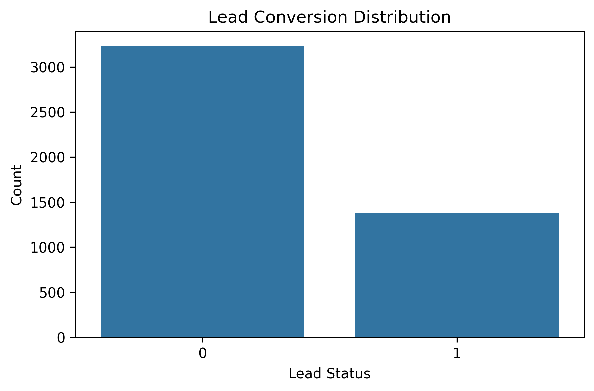
</div>

<br>

The target distribution shows that non-converted leads represent the majority of the dataset, reflecting a realistic business scenario where only a fraction of generated leads become paying customers.

To ensure reliable model evaluation, multiple classification metrics were considered throughout development instead of relying solely on overall accuracy.

---

# 🛠️ Technology Stack

The project leverages a modern Python-based machine learning ecosystem for data processing, visualization, predictive modeling, and explainable artificial intelligence.

| Category | Technologies |
|----------|--------------|
| **Programming Language** | Python |
| **Data Analysis** | Pandas, NumPy |
| **Data Visualization** | Matplotlib, Seaborn, Plotly |
| **Machine Learning** | Scikit-learn, XGBoost |
| **Explainable AI** | SHAP |
| **Development Environment** | Google Colab |
| **Version Control** | Git & GitHub |

---

# 🔄 Project Workflow

<div align="center">
  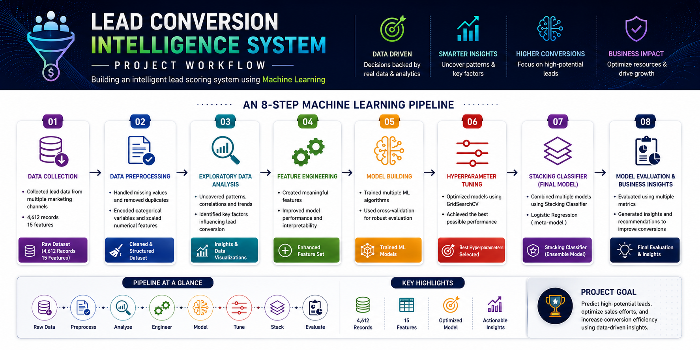
</div>

<br>

The project follows a structured end-to-end machine learning workflow that transforms raw customer information into actionable business intelligence.

Each stage builds upon the previous one, ensuring that the final solution remains accurate, interpretable, and suitable for real-world lead prioritization.

1. **Data Collection** – Import and understand the raw lead dataset.
2. **Data Cleaning** – Handle missing values, remove inconsistencies, and prepare high-quality data.
3. **Exploratory Data Analysis (EDA)** – Discover customer behavior patterns and relationships between features.
4. **Feature Engineering** – Transform categorical variables into machine learning-ready features.
5. **Data Preprocessing** – Prepare the dataset for training through encoding, scaling, and train-test splitting.
6. **Model Development** – Train and compare multiple supervised learning algorithms.
7. **Hyperparameter Optimization** – Improve model performance through systematic parameter tuning.
8. **Final Model Selection** – Select the Stacking Classifier based on predictive performance and generalization capability.
9. **Model Explainability** – Interpret feature contributions using SHAP.
10. **Business Recommendations** – Convert analytical insights into practical business strategies.

---

## 🎯 Why This Workflow?

The objective of this workflow extends beyond achieving high predictive accuracy. Every stage is designed to improve data quality, strengthen model reliability, enhance interpretability, and ensure that the final solution delivers meaningful value to business stakeholders.

The result is a production-oriented machine learning pipeline capable of generating accurate predictions while providing transparent insights that support confident, data-driven decision-making.

---

---

# 🤖 Model Development

A structured experimentation strategy was adopted to identify the most effective machine learning solution for lead conversion prediction. Rather than selecting a model based on a single performance metric, multiple supervised learning algorithms were trained, evaluated, and compared using the same preprocessing pipeline and evaluation framework.

The primary objective was to develop a model capable of delivering reliable predictions while maintaining strong generalization, balanced classification performance, and practical business applicability.

---

## 🧪 Machine Learning Models Evaluated

The following supervised learning algorithms were evaluated throughout the experimentation process:

| Model | Purpose |
|--------|---------|
| Logistic Regression | Establish an interpretable baseline model |
| Decision Tree | Capture non-linear decision boundaries |
| Random Forest | Improve prediction stability through bagging |
| XGBoost | Learn complex feature interactions using gradient boosting |
| Voting Classifier | Evaluate ensemble learning performance |
| ⭐ Stacking Classifier | Final production model |

Each algorithm was trained using the same processed dataset, ensuring a fair and consistent comparison before selecting the final model.

---

## ⚙️ Hyperparameter Optimization

To maximize predictive performance, promising machine learning models were systematically optimized through hyperparameter tuning instead of relying on default configurations.

This process improved model stability, enhanced generalization capability, and reduced the likelihood of overfitting, resulting in a more reliable predictive solution.

---

# 📊 Final Model Performance

After evaluating all candidate models, the **Stacking Classifier** demonstrated the strongest overall balance between predictive performance and generalization, making it the final model selected for this project.

<div align="center">
  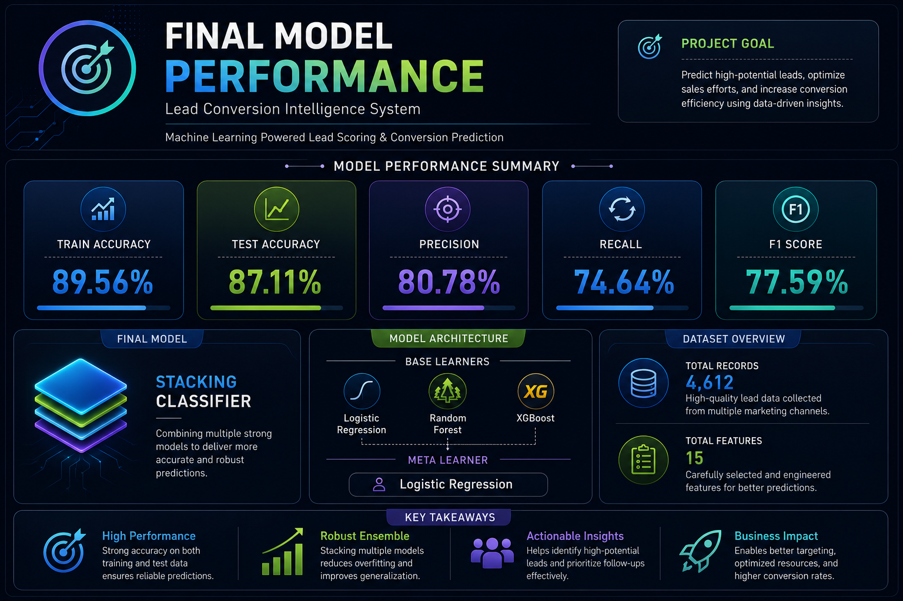
</div>

<br>

The final model was evaluated using multiple classification metrics to provide a balanced assessment of prediction quality.

| Metric | Performance |
|---------|------------:|
| **Training Accuracy** | **89.56%** |
| **Testing Accuracy** | **87.11%** |
| **Precision** | **80.78%** |
| **Recall** | **74.64%** |
| **F1-Score** | **77.59%** |

The close alignment between training and testing accuracy demonstrates that the model successfully learned meaningful patterns from the training data while maintaining strong predictive capability on previously unseen samples.

The balanced Precision, Recall, and F1-Score further indicate that the model performs consistently across both converted and non-converted leads, making it suitable for practical lead scoring applications.

---

## 🎯 Confusion Matrix

The confusion matrix illustrates the classification performance of the final stacking classifier by comparing actual and predicted lead conversion outcomes.

<div align="center">
  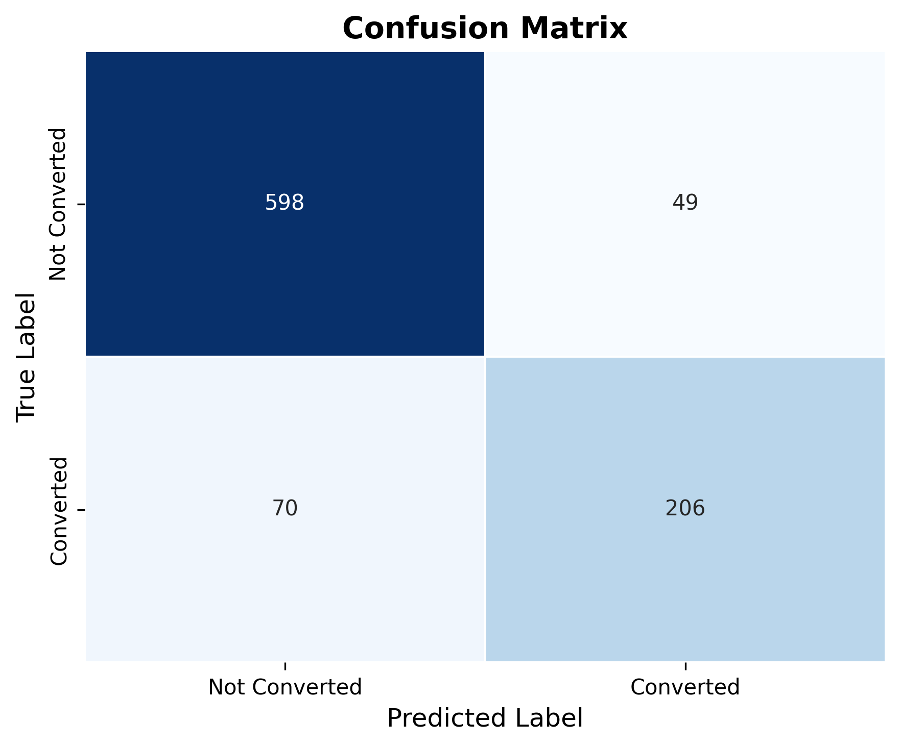
</div>

<br>


## ✅ Model Validation

Model validation focused on evaluating both predictive performance and generalization capability.

With a training accuracy of **89.56%** and a testing accuracy of **87.11%**, only a small performance gap is observed, indicating that the model does not exhibit significant overfitting and is capable of generating reliable predictions on unseen data.

The Confusion Matrix further confirms that the model maintains a balanced classification performance across both target classes instead of optimizing only overall accuracy.

---

## 🏆 Why the Stacking Classifier?

Instead of relying on a single learning algorithm, the final solution combines predictions from multiple machine learning models through a **Stacking** architecture, where a meta-model learns how to leverage the strengths of individual base learners.

This ensemble strategy consistently delivered the strongest overall performance during experimentation while maintaining stable generalization on unseen data.

Compared with individual algorithms, the Stacking Classifier provides:

- ✅ Higher overall predictive performance
- ✅ Better balance between Precision, Recall, and F1-Score
- ✅ Improved robustness against overfitting
- ✅ More stable predictions across different customer segments
- ✅ Greater reliability for real-world lead prioritization

The combination of ensemble learning and balanced evaluation metrics makes the Stacking Classifier well suited for intelligent lead conversion prediction in business environments.

---

---

# 🔍 Model Explainability (SHAP)

High predictive accuracy alone is often insufficient for real-world business applications. Decision-makers also need to understand **why** a model makes a particular prediction before they can confidently rely on its recommendations.

To improve model transparency, this project incorporates **SHAP (SHapley Additive exPlanations)**, an explainable AI technique that quantifies the contribution of each feature toward individual predictions. SHAP enables both technical and business stakeholders to interpret model behavior, validate predictions, and identify the key factors influencing lead conversion.

Although the **Stacking Classifier** was selected as the final predictive model, SHAP analysis was performed using the **Gradient Boosting** model because tree-based algorithms provide efficient, consistent, and highly interpretable feature-level explanations.

---

## 📊 Global Feature Importance

<div align="center">
  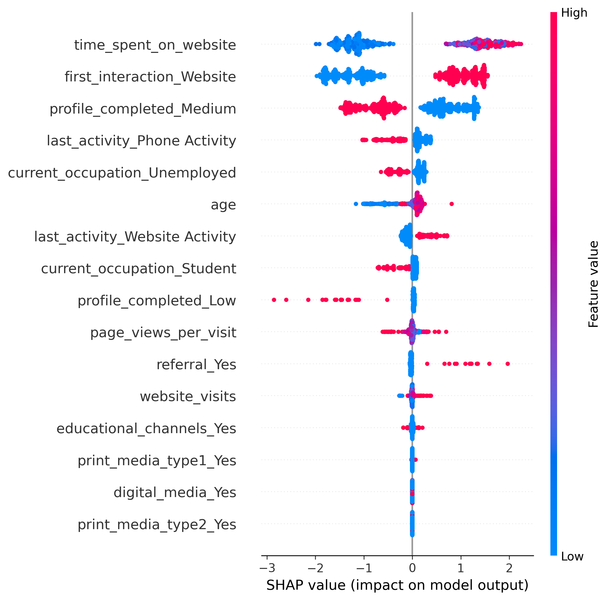
</div>

<br>

The SHAP Summary Plot provides a global view of feature importance across the entire dataset. Features with larger SHAP values have a greater influence on model predictions, while color variations illustrate how different feature values affect the likelihood of lead conversion.

This visualization helps identify the customer characteristics that consistently contribute to successful conversions and supports more informed business decision-making.

---

## 🌊 Individual Prediction Explanation

<div align="center">
  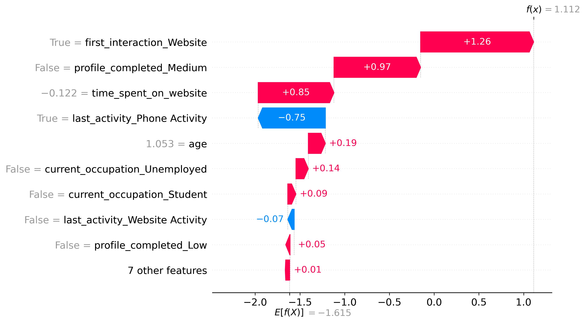
</div>

<br>

The SHAP Waterfall Plot explains how individual feature values influence the prediction for a single customer.

Each feature either increases or decreases the predicted probability of conversion, allowing the complete decision-making process behind an individual prediction to be interpreted step by step.

### Key Insights

- ✅ Customer engagement features contributed more strongly than demographic attributes.
- ✅ Website interaction played a significant role in increasing conversion probability.
- ✅ Individual predictions were influenced by the combined contribution of multiple features rather than a single dominant variable.
- ✅ SHAP explanations improved transparency by clearly identifying the factors driving each prediction.

---

# 💼 Business Impact

This solution transforms predictive analytics into a practical decision-support system for sales and marketing teams.

Rather than manually prioritizing leads, organizations can use prediction scores and SHAP explanations to identify high-value prospects, allocate resources more efficiently, and make faster, evidence-based business decisions.

Key business benefits include:

- 📈 More effective lead prioritization.
- 🎯 Improved sales productivity.
- 💰 Better utilization of marketing budgets.
- ⚡ Faster decision-making through predictive lead scoring.
- 📊 Increased confidence in model predictions through explainable AI.

---

# 💡 Business Recommendations

Based on the predictive analysis and model explainability, the following recommendations can help improve lead conversion performance:

- 🎯 Prioritize leads with the highest predicted conversion probability.
- 🌐 Increase engagement with website visitors demonstrating strong buying intent.
- 📈 Allocate marketing resources toward the most effective acquisition channels.
- 📝 Encourage customers to complete missing profile information before sales engagement.
- 🔗 Integrate the prediction model into CRM systems to automate lead scoring and prioritization.

---

# 🖥️ Streamlit Application Preview

The project has been deployed as an interactive Streamlit application that enables real-time lead conversion prediction and business intelligence analysis.

## 🚀 Prediction Workspace

<div align="center">
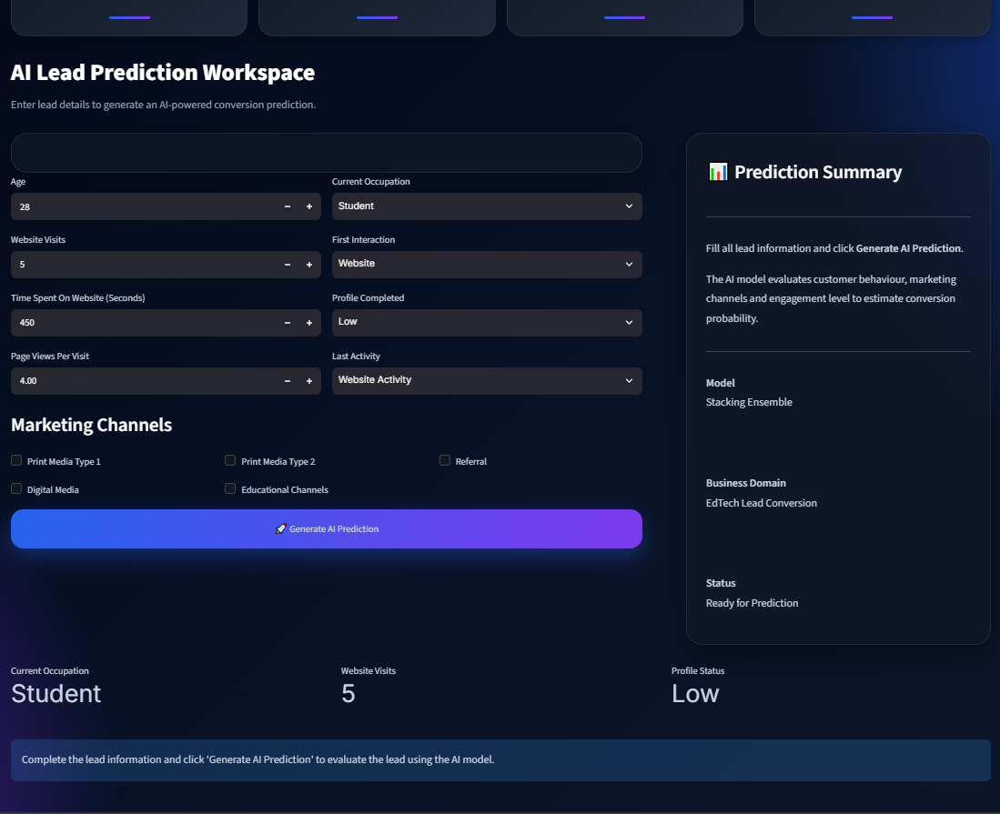
</div>


## 🎯 Prediction Result

<div align="center">
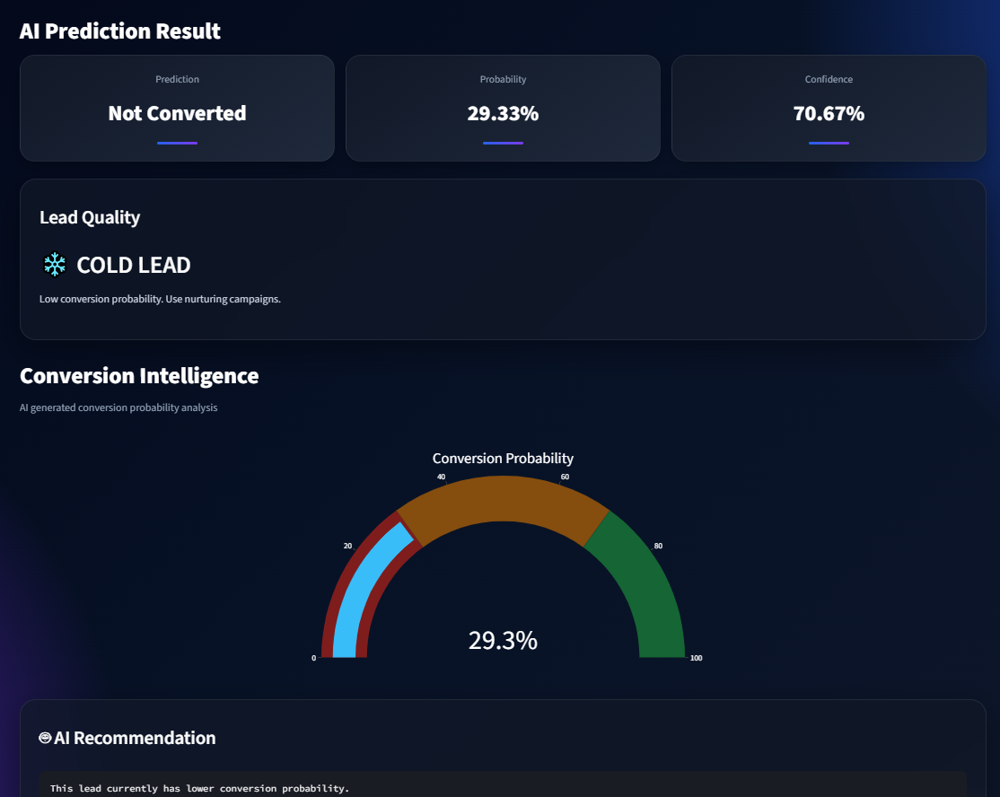
</div>


## 📊 Analytics Dashboard

<div align="center">
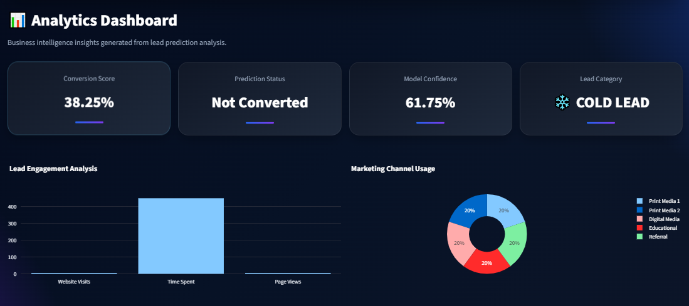
</div>


## 🤖 AI Business Intelligence

<div align="center">
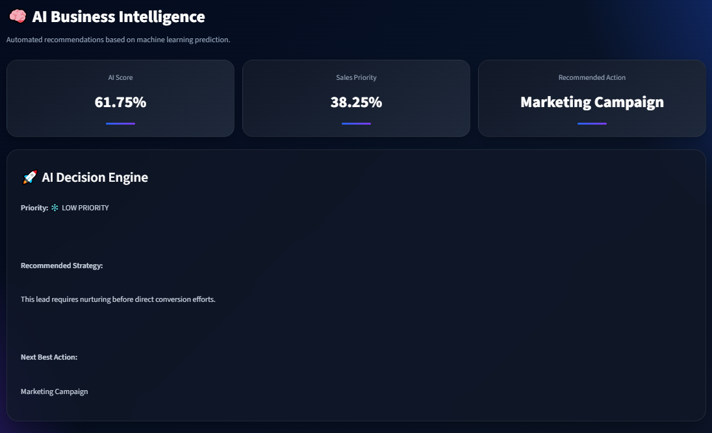
</div>


## 🔍 Feature Insights

<div align="center">
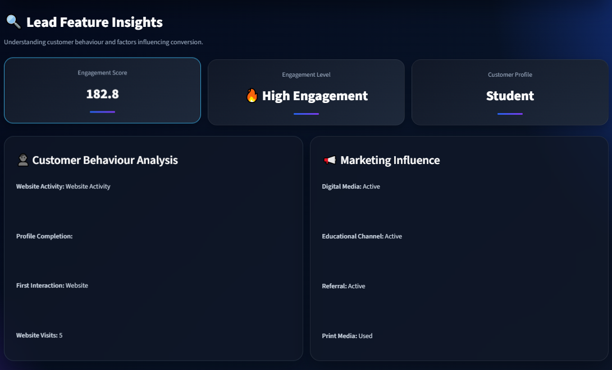
</div>

---

# 🚀 Future Scope

The current system provides real-time lead conversion prediction through an interactive Streamlit application. Future enhancements can focus on scalability, automation, and enterprise integration.

Potential future improvements include:

- 🔗 Integrate the prediction engine with CRM platforms for automated lead scoring.
- 📊 Develop an interactive Power BI dashboard for business stakeholders.
- 🔄 Implement automated model retraining using newly collected customer data.
- 📈 Monitor model performance and data drift to maintain long-term prediction reliability.
- ☁️ Migrate the application to scalable cloud infrastructure for enterprise-level usage.

---

# 🎯 Conclusion

This project demonstrates a complete end-to-end machine learning solution for intelligent lead conversion prediction within the EdTech domain.

From data preprocessing and exploratory analysis to ensemble learning, hyperparameter optimization, and explainable AI, every stage of the workflow was designed to improve predictive performance while maintaining transparency and practical business relevance.

The final **Stacking Classifier** achieved the strongest overall performance, while SHAP explainability provided meaningful insights into the factors influencing customer conversion. Together, these components create a reliable decision-support system capable of improving lead prioritization, optimizing marketing investments, and supporting data-driven business strategies.

---

# ✅ Project Outcome

- ✔ Successfully developed a complete end-to-end Lead Conversion Prediction System.
- ✔ Compared multiple supervised and ensemble learning algorithms.
- ✔ Applied feature engineering, hyperparameter optimization, ensemble learning, and SHAP-based explainability.
- ✔ Selected the **Stacking Classifier** as the final predictive model based on overall performance.
- ✔ Generated actionable business insights to support intelligent sales and marketing decisions.

---

---

# 📂 Repository Structure

```text
Lead-Conversion-Intelligence-System/

│
├── data/
│   └── ExtraaLearn.csv
│
├── images/
│   ├── banner.png
│   ├── project_workflow.png
│   ├── lead_conversion_distribution.png
│   ├── final_model_metrics.png
│   ├── confusion_matrix.png
│   ├── shap_summary.png
│   ├── shap_waterfall.png
│   ├── prediction_workspace.png
│   ├── prediction_result.png
│   ├── analytics_dashboard.png
│   ├── ai_business_intelligence.png
│   ├── executive_overview.png
│   ├── feature_insights.png
│   └── lead_feature_analysis.png
│
├── notebooks/
│   └── Lead_Conversion_Intelligence_System.ipynb
│
├── app.py
├── predictor.py
│
├── meta_model.pkl
├── lr_model.pkl
├── rf_model.pkl
├── scaler.pkl
├── feature_columns.pkl
├── booster_only.json
│
├── README.md
├── requirements.txt
├── LICENSE
└── .gitignore
```

---

# 💻 Getting Started

Follow the steps below to run this project locally.

### 1️⃣ Clone the Repository

```bash
git clone https://github.com/alinkumar2977/Lead-Conversion-Intelligence-System.git
```

---

### 2️⃣ Navigate to the Project Directory

```bash
cd Lead-Conversion-Intelligence-System
```

---

### 3️⃣ Install the Required Dependencies

```bash
pip install -r requirements.txt
```

---

### 4️⃣ Launch Streamlit Application

Run the following command:

```bash
streamlit run app.py
```

The application will open in your browser and provide real-time lead conversion prediction, analytics dashboard, and AI-generated business recommendations.


# 📦 Project Requirements

The project was developed using the following core technologies.

| Component | Version |
|-----------|---------|
| Python | 3.10+ |
| Scikit-learn | Latest Stable |
| XGBoost | Latest Stable |
| SHAP | Latest Stable |
| Pandas | Latest Stable |
| NumPy | Latest Stable |
| Matplotlib | Latest Stable |
| Seaborn | Latest Stable |

All dependencies required to reproduce this project are available in the `requirements.txt` file.

---

# 👨‍💻 Author

## Alin Kumar

**Data Analyst** | **Aspiring Data Scientist**

Passionate about building end-to-end machine learning solutions that transform raw data into actionable business insights through predictive analytics and explainable AI.

### Connect with Me

- 🐙 GitHub: **[GitHub Profile](https://github.com/alinkumar2977)**
- 💼 LinkedIn: **[Alin Kumar](https://www.linkedin.com/in/alinkumar2977/)**
- 📧 Email: **alinkumar2977@gmail.com**

---

# 📄 License

This project is distributed under the **MIT License**.

You are free to use, modify, and distribute this project in accordance with the terms of the license.

---

# ⭐ Support

If you found this repository helpful, consider giving it a ⭐ on GitHub.

Your support helps increase the visibility of the project and motivates the development of more practical machine learning solutions.

---

<div align="center">

### 🚀 Built with Python • Scikit-learn • XGBoost • SHAP • Machine Learning


</div>